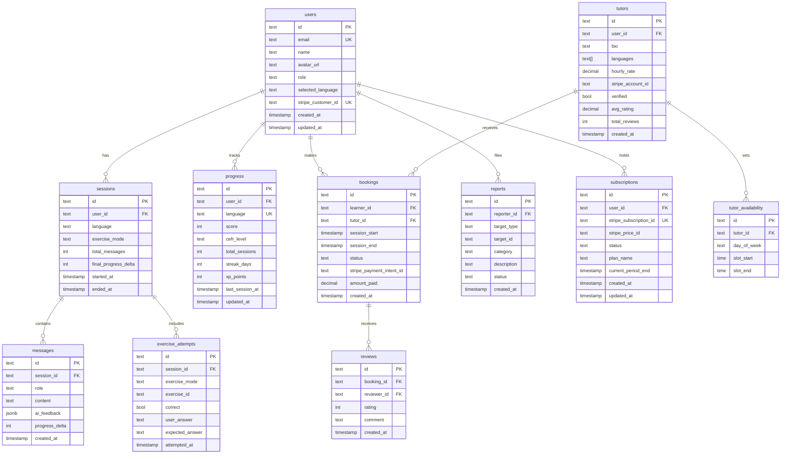

# Database Schema
**Skill applied:** `database-schema-designer`  
**ORM:** Drizzle ORM + NeonDB (PostgreSQL)  
**Date:** 2026-04-08

---

## ERD (Mermaid)



---

## Drizzle Schema (`db/schema.ts`)

```typescript
import {
  pgTable, text, integer, boolean, decimal, timestamp,
  jsonb, time, uniqueIndex, index
} from "drizzle-orm/pg-core"

// ─── Users ───────────────────────────────────────────────
export const users = pgTable("users", {
  id:                 text("id").primaryKey().$defaultFn(() => crypto.randomUUID()),
  email:              text("email").notNull().unique(),
  name:               text("name"),
  avatarUrl:          text("avatar_url"),
  role:               text("role", { enum: ["learner", "tutor", "admin"] }).notNull().default("learner"),
  selectedLanguage:   text("selected_language").default("no"),
  stripeCustomerId:   text("stripe_customer_id").unique(),
  createdAt:          timestamp("created_at").defaultNow().notNull(),
  updatedAt:          timestamp("updated_at").defaultNow().notNull(),
})

// ─── Sessions ────────────────────────────────────────────
export const sessions = pgTable("sessions", {
  id:                 text("id").primaryKey().$defaultFn(() => crypto.randomUUID()),
  userId:             text("user_id").notNull().references(() => users.id, { onDelete: "cascade" }),
  language:           text("language").notNull().default("no"),
  exerciseMode:       text("exercise_mode").default("free_conversation"),
  totalMessages:      integer("total_messages").default(0),
  finalProgressDelta: integer("final_progress_delta").default(0),
  startedAt:          timestamp("started_at").defaultNow().notNull(),
  endedAt:            timestamp("ended_at"),
}, (t) => ({
  userIdx: index("sessions_user_id_idx").on(t.userId),
}))

// ─── Messages ────────────────────────────────────────────
export const messages = pgTable("messages", {
  id:             text("id").primaryKey().$defaultFn(() => crypto.randomUUID()),
  sessionId:      text("session_id").notNull().references(() => sessions.id, { onDelete: "cascade" }),
  role:           text("role", { enum: ["user", "assistant"] }).notNull(),
  content:        text("content").notNull(),
  aiFeedback:     jsonb("ai_feedback"),  // { summary, fixes, improvedVersion, nextQuestion, hint }
  progressDelta:  integer("progress_delta").default(0),
  createdAt:      timestamp("created_at").defaultNow().notNull(),
}, (t) => ({
  sessionIdx: index("messages_session_id_idx").on(t.sessionId),
}))

// ─── Progress ────────────────────────────────────────────
export const progress = pgTable("progress", {
  id:             text("id").primaryKey().$defaultFn(() => crypto.randomUUID()),
  userId:         text("user_id").notNull().references(() => users.id, { onDelete: "cascade" }),
  language:       text("language").notNull(),
  score:          integer("score").notNull().default(0),
  cefrLevel:      text("cefr_level", { enum: ["A1", "A2", "B1", "B2"] }).notNull().default("A1"),
  totalSessions:  integer("total_sessions").default(0),
  streakDays:     integer("streak_days").default(0),
  xpPoints:       integer("xp_points").default(0),
  lastSessionAt:  timestamp("last_session_at"),
  updatedAt:      timestamp("updated_at").defaultNow().notNull(),
}, (t) => ({
  userLangUniq: uniqueIndex("progress_user_language_uniq").on(t.userId, t.language),
}))

// ─── Exercise Attempts ───────────────────────────────────
export const exerciseAttempts = pgTable("exercise_attempts", {
  id:             text("id").primaryKey().$defaultFn(() => crypto.randomUUID()),
  sessionId:      text("session_id").notNull().references(() => sessions.id, { onDelete: "cascade" }),
  exerciseMode:   text("exercise_mode").notNull(),
  exerciseId:     text("exercise_id"),
  correct:        boolean("correct"),
  userAnswer:     text("user_answer"),
  expectedAnswer: text("expected_answer"),
  attemptedAt:    timestamp("attempted_at").defaultNow().notNull(),
})

// ─── Tutors ──────────────────────────────────────────────
export const tutors = pgTable("tutors", {
  id:               text("id").primaryKey().$defaultFn(() => crypto.randomUUID()),
  userId:           text("user_id").notNull().references(() => users.id, { onDelete: "cascade" }).unique(),
  bio:              text("bio"),
  languages:        text("languages").array().notNull().default([]),
  hourlyRate:       decimal("hourly_rate", { precision: 10, scale: 2 }),
  stripeAccountId:  text("stripe_account_id"),
  verified:         boolean("verified").default(false),
  avgRating:        decimal("avg_rating", { precision: 3, scale: 2 }).default("0"),
  totalReviews:     integer("total_reviews").default(0),
  createdAt:        timestamp("created_at").defaultNow().notNull(),
})

// ─── Tutor Availability ──────────────────────────────────
export const tutorAvailability = pgTable("tutor_availability", {
  id:          text("id").primaryKey().$defaultFn(() => crypto.randomUUID()),
  tutorId:     text("tutor_id").notNull().references(() => tutors.id, { onDelete: "cascade" }),
  dayOfWeek:   text("day_of_week", { enum: ["mon","tue","wed","thu","fri","sat","sun"] }).notNull(),
  slotStart:   time("slot_start").notNull(),
  slotEnd:     time("slot_end").notNull(),
})

// ─── Bookings ────────────────────────────────────────────
export const bookings = pgTable("bookings", {
  id:                     text("id").primaryKey().$defaultFn(() => crypto.randomUUID()),
  learnerId:              text("learner_id").notNull().references(() => users.id),
  tutorId:                text("tutor_id").notNull().references(() => tutors.id),
  sessionStart:           timestamp("session_start").notNull(),
  sessionEnd:             timestamp("session_end").notNull(),
  status:                 text("status", { enum: ["pending","confirmed","completed","cancelled"] }).notNull().default("pending"),
  stripePaymentIntentId:  text("stripe_payment_intent_id"),
  amountPaid:             decimal("amount_paid", { precision: 10, scale: 2 }),
  createdAt:              timestamp("created_at").defaultNow().notNull(),
}, (t) => ({
  learnerIdx: index("bookings_learner_id_idx").on(t.learnerId),
  tutorIdx:   index("bookings_tutor_id_idx").on(t.tutorId),
}))

// ─── Reviews ─────────────────────────────────────────────
export const reviews = pgTable("reviews", {
  id:          text("id").primaryKey().$defaultFn(() => crypto.randomUUID()),
  bookingId:   text("booking_id").notNull().references(() => bookings.id).unique(),
  reviewerId:  text("reviewer_id").notNull().references(() => users.id),
  rating:      integer("rating").notNull(),  // 1–5
  comment:     text("comment"),
  createdAt:   timestamp("created_at").defaultNow().notNull(),
})

// ─── Subscriptions ───────────────────────────────────────
export const subscriptions = pgTable("subscriptions", {
  id:                   text("id").primaryKey().$defaultFn(() => crypto.randomUUID()),
  userId:               text("user_id").notNull().references(() => users.id, { onDelete: "cascade" }).unique(),
  stripeSubscriptionId: text("stripe_subscription_id").unique(),
  stripePriceId:        text("stripe_price_id"),
  status:               text("status", { enum: ["active","trialing","past_due","canceled","unpaid"] }),
  planName:             text("plan_name", { enum: ["free","pro","premium"] }).notNull().default("free"),
  currentPeriodEnd:     timestamp("current_period_end"),
  createdAt:            timestamp("created_at").defaultNow().notNull(),
  updatedAt:            timestamp("updated_at").defaultNow().notNull(),
})

// ─── Reports ─────────────────────────────────────────────
export const reports = pgTable("reports", {
  id:           text("id").primaryKey().$defaultFn(() => crypto.randomUUID()),
  reporterId:   text("reporter_id").notNull().references(() => users.id),
  targetType:   text("target_type", { enum: ["session","message","booking","user"] }).notNull(),
  targetId:     text("target_id").notNull(),
  category:     text("category", { enum: ["abuse","spam","technical","other"] }).notNull(),
  description:  text("description"),
  status:       text("status", { enum: ["open","reviewing","resolved","dismissed"] }).notNull().default("open"),
  createdAt:    timestamp("created_at").defaultNow().notNull(),
})
```

---

## Index Strategy

| Table | Index | Reason |
|---|---|---|
| `sessions` | `(user_id)` | Fetch user's session list |
| `messages` | `(session_id)` | Load all messages in a session |
| `progress` | `(user_id, language)` UNIQUE | One progress row per user per language |
| `bookings` | `(learner_id)`, `(tutor_id)` | Fetch bookings for each side |
| `tutor_availability` | `(tutor_id)` | Load tutor schedule |

---

## Migration Commands

```bash
# Generate migration
npx drizzle-kit generate

# Apply to dev
npx drizzle-kit push

# Apply to prod
npx drizzle-kit migrate
```

---

## Common Pitfalls Avoided

- All PKs use `crypto.randomUUID()` — no sequential integer leakage
- `progress` has a composite unique index — prevents duplicate rows per user/language
- `reviews` enforces one review per booking via `.unique()` on `bookingId`
- Cascade deletes on `sessions → messages` and `users → sessions`
- All timestamps use `timestamp` (not `date`) for timezone-safe storage
