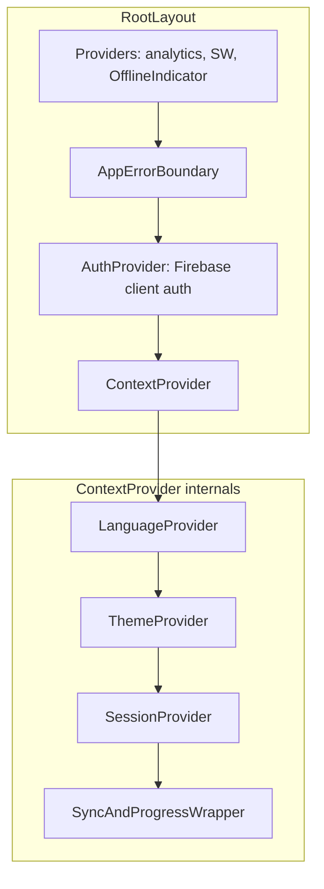
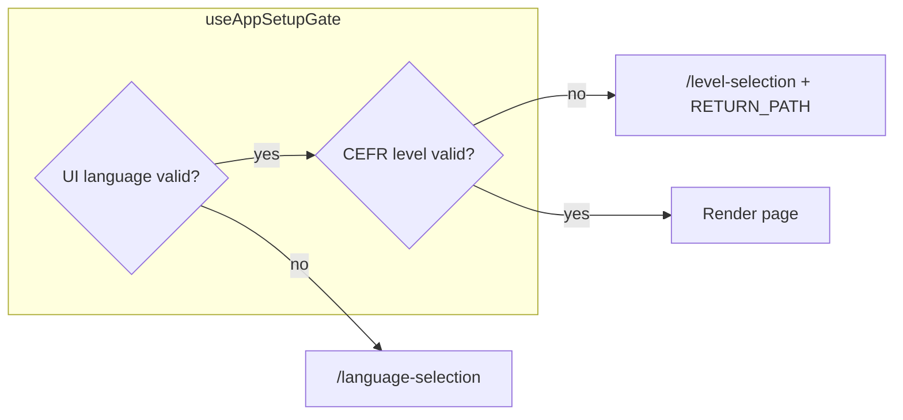
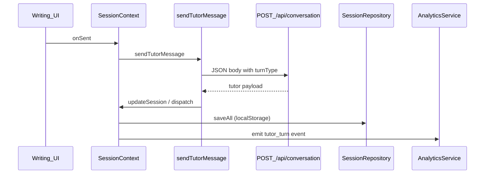

# Application flow — Norwegian Tutor (target / redesigned)

> **Status:** Target specification for product direction. For **as-built** behavior see [application-flow.md](application-flow.md).

End-to-end flows for **Norwegian Tutor** (Next.js App Router): provider bootstrap, onboarding gates, writing vs speaking tutor paths, unified session persistence, CEFR progression engine, and Firebase auth.

> **What changed from baseline:** Speaking sessions feed into the shared session layer. The auth gate is a non-blocking soft nudge. Exercise mode uses a dedicated `turnType` field instead of synthetic message injection. An analytics event stream feeds a CEFR auto-progression engine. Session restore uses explicit timestamp resolution.

---

## 1) Runtime / provider stack

No change from baseline. Global composition in [`app/layout.tsx`](../../app/layout.tsx):

---

## 2) Onboarding gate

Unchanged from baseline. `useAppSetupGate` checks `norsk_ui_language` and `norsk_cefr_level` in `localStorage`. Missing values redirect to `/language-selection` or `/level-selection` with `RETURN_PATH` preserved in `sessionStorage`.

---

## 3) Writing (text chat) flow — improved

### 3a) Auth gate: soft nudge + hard cap

- At message **3**, fire `CUSTOM_EVENTS.AUTH_NUDGE`; dismissible banner; send **not** blocked.
- Hard block at **50** messages for anonymous users (`CUSTOM_EVENTS.AUTH_REQUIRED`).

### 3b) Exercise mode: `turnType`

- `turnType: "exercise_start"` in the conversation request; no synthetic `[EXERCISE_START]` user line in session history.

### 3c) Analytics

- `AnalyticsService.emit({ event: "tutor_turn", ... })` feeds the CEFR progression engine.

### 3d) Full write path

---

## 4) Speaking (voice) flow — improved

- **Fallback:** connection failure → `/writing` with toast.
- **Persistence:** speaking turns appended to active session messages (metadata) for unified `localStorage` / sync.

---

## 5) Session snapshot sync

- Snapshot includes bundle `updatedAt`; merge uses last-write-wins vs local bundle metadata before applying sessions.

---

## 6) CEFR Progression Engine

- Rolling-window rules in `lib/constants.ts`; non-blocking dashboard banner; user confirms level changes.

---

## 7) Authentication

No structural change from baseline.

---

## 8) Route surface map (updated)

| Route | Role |
|-------|------|
| `/` | Dashboard hub |
| `/writing` | Chat layout |
| `/speaking` | Voice + pronunciation |
| `/level-selection`, `/language-selection` | Onboarding |
| `/settings`, `/review`, `/progress`, `/tutors` | Secondary features |
| `/auth` | Sign-in |
| `/api/*` | See baseline route table |

---

## Related docs

- [User journey map (target)](user-journey-map-target.md)
- [Application flow (baseline)](application-flow.md)
