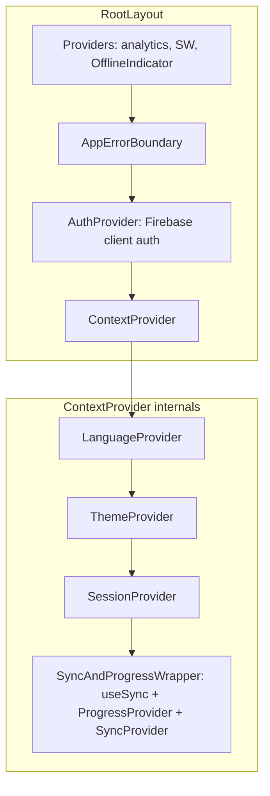
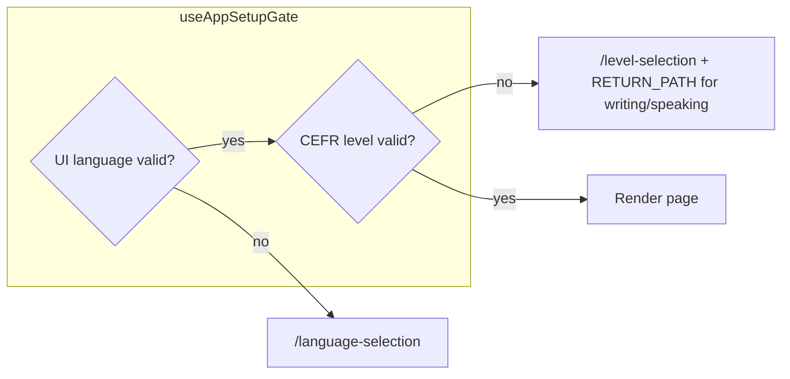
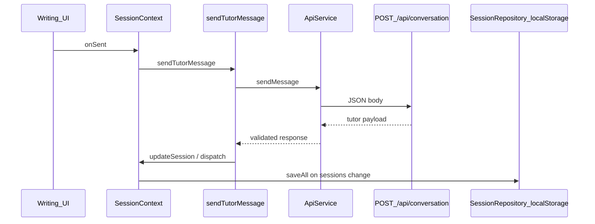
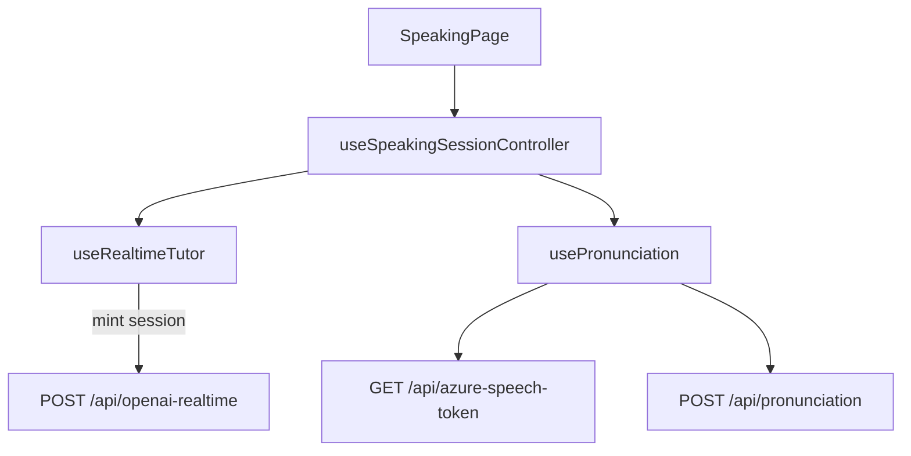
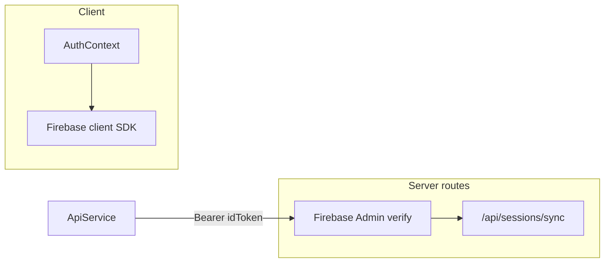

# Complete application flow (Norwegian Tutor)

> **As-built:** This document reflects **current code**. For the **target / redesigned** product direction, see [Application flow (target)](application-flow-target.md).

End-to-end flows for **Norwegian Tutor** (Next.js App Router): provider bootstrap, onboarding gates, writing vs speaking tutor paths, session persistence (client + server), and Firebase auth. Diagrams use [Mermaid](https://mermaid.js.org/).

## 1) Runtime / provider stack

Global composition lives in [`app/layout.tsx`](../../app/layout.tsx): `Providers` → `AppErrorBoundary` → `AuthProvider` → `ContextProvider` (`Language` → `Theme` → `Session` → sync/progress wrapper).

## 2) First-time setup and navigation gates

- **Dashboard** ([`app/page.tsx`](../../app/page.tsx)) uses [`useAppSetupGate("dashboard")`](../../src/hooks/useAppSetupGate.ts): requires valid UI language in `localStorage` (`norsk_ui_language`) and CEFR level (`norsk_cefr_level`); otherwise redirects to `/language-selection` or `/level-selection`.
- **Writing** ([`app/writing/page.tsx`](../../app/writing/page.tsx)) and **Speaking** ([`app/speaking/page.tsx`](../../app/speaking/page.tsx)) use the same gate with `mode` `"writing"` / `"speaking"`, storing `RETURN_PATH` in `sessionStorage` so level selection can return the user to the right route.
- **Session bootstrap** ([`src/context/SessionContext.tsx`](../../src/context/SessionContext.tsx)): on load, optionally **restores** a server snapshot via [`ApiService.tryRestoreServerSessionSnapshot`](../../src/services/apiService.ts) → `GET /api/sessions/restore` if newer than local; if no CEFR level, `router.push("/level-selection")`; debounced **sync** to server via `POST /api/sessions/sync` (~2.5s after sessions change).

## 3) Writing (text chat) flow

UI: [`Sidebar`](../../src/components/sidebar/Sidebar.tsx) + [`Main`](../../src/components/main/Main.tsx) under `/writing`.

Message send path:

1. User submits input → [`SessionContext.onSent`](../../src/context/SessionContext.tsx) → [`sendTutorMessage`](../../src/application/tutoring/sendTutorMessage.ts).
2. **Auth gate (soft):** after `AUTH_REQUIRED_MESSAGE_COUNT` anonymous messages, unauthenticated users get `CUSTOM_EVENTS.AUTH_REQUIRED` and send is blocked until sign-in ([`sendTutorMessage.ts`](../../src/application/tutoring/sendTutorMessage.ts)).
3. **API:** [`ApiService.sendMessage`](../../src/services/apiService.ts) → `POST /api/conversation` ([`app/api/conversation/route.ts`](../../app/api/conversation/route.ts)) → `runConversationTurn` + Gemini adapter.
4. Optional streaming variant: `POST /api/conversation-stream` ([`ApiService.sendMessageStreaming`](../../src/services/apiService.ts)).
5. Response updates session messages, hints, exercise scoring; [`SessionRepository`](../../src/repositories/sessionRepository.ts) persists to **localStorage**; logged-in users also trigger per-session sync via [`useSync`](../../src/hooks/useSync.ts) / [`SyncService`](../../src/services/syncService.ts).

Exercise modes: [`setExerciseMode`](../../src/context/SessionContext.tsx) → [`startExercise`](../../src/application/tutoring/startExercise.ts) → same `ApiService.sendMessage` with synthetic `"[EXERCISE_START]"` user line.

## 4) Speaking (voice) flow

[`SpeakingPage`](../../app/speaking/page.tsx) → [`useSpeakingSessionController`](../../src/components/speaking/useSpeakingSessionController.ts):

- **Realtime voice:** [`useRealtimeTutor`](../../src/hooks/useRealtimeTutor.ts) → [`ApiService.mintOpenaiRealtimeSession`](../../src/services/apiService.ts) → `POST /api/openai-realtime`.
- **Pronunciation assessment:** [`usePronunciation`](../../src/hooks/usePronunciation.ts) → typically `POST /api/pronunciation` and Azure token via `GET /api/azure-speech-token` ([`ApiService.getAzureSpeechToken`](../../src/services/apiService.ts)).

CEFR level comes from [`SessionContext`](../../src/context/SessionContext.tsx) (defaults to A1 in the speaking controller if missing).

## 5) Session snapshot sync (cross-device / backup)

- **Client:** [`syncSessionSnapshotToServer`](../../src/services/apiService.ts) sends `x-device-id` + optional `Authorization: Bearer` Firebase ID token to `POST /api/sessions/sync`.
- **Server:** [`app/api/sessions/sync/route.ts`](../../app/api/sessions/sync/route.ts) verifies token via [`verifyFirebaseIdTokenFromRequest`](../../lib/firebase/firebaseAdmin.ts), persists via [`sessionSnapshotStore`](../../src/server/persistence/sessionSnapshotStore.ts) (Redis/Upstash when configured).
- **Restore:** `GET /api/sessions/restore` with same headers; client merges if server snapshot is newer ([`SessionContext` init effect](../../src/context/SessionContext.tsx)).

## 6) Authentication (parallel concern)

- **Client:** [`AuthProvider`](../../src/context/AuthContext.tsx) wraps Firebase (`signIn`, Google, etc.), persists minimal user to `norsk_user`, and **associates** anonymous `norsk_sessions` with `user.uid` on login.
- **Protected server ops:** session sync/restore accept Bearer token; anonymous path uses `x-device-id` where allowed ([`sessions/sync/route.ts`](../../app/api/sessions/sync/route.ts)).
- **Auth page:** [`app/auth/page.tsx`](../../app/auth/page.tsx).

## 7) Route surface map

| Route | Role |
|-------|------|
| [`/`](../../app/page.tsx) | Dashboard hub |
| [`/writing`](../../app/writing/page.tsx) | Chat layout |
| [`/speaking`](../../app/speaking/page.tsx) | Voice + pronunciation |
| [`/level-selection`](../../app/level-selection/page.tsx), [`/language-selection`](../../app/language-selection/page.tsx) | Onboarding |
| [`/settings`](../../app/settings/page.tsx), [`/review`](../../app/review/page.tsx), [`/progress`](../../app/progress/page.tsx), [`/tutors`](../../app/tutors/page.tsx) | Secondary features (same app shell / contexts) |
| [`/auth`](../../app/auth/page.tsx) | Sign-in |
| [`/api/healthz`](../../app/api/healthz/route.ts) | Liveness |
| [`/api/initial-question`](../../app/api/initial-question/route.ts) | Level prompts (session / welcome flows) |
| [`/api/checkout`](../../app/api/checkout/route.ts) | Payments (if enabled) |

## Related docs

- [Application flow (target)](application-flow-target.md) — redesigned flows (roadmap).
- [Current architecture (baseline)](current.md) — provider order and session layer detail.
- [User journey map](user-journey-map.md) — personas, stages, and UX-oriented touchpoints.
- [User journey map (target)](user-journey-map-target.md) — redesigned journeys.
