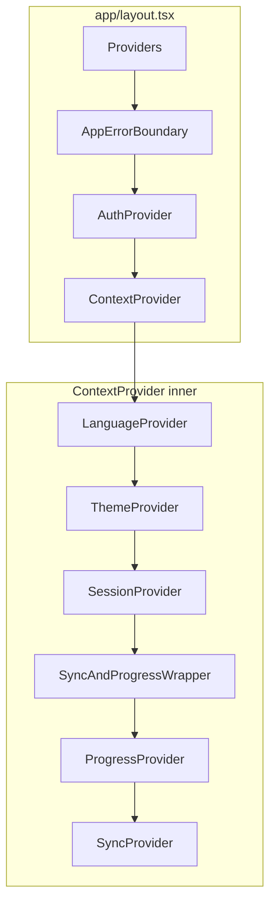

# Current architecture (baseline)

This document captures the **as-built** client composition and session layer for **norsk-tutor** (Next.js 14 App Router). It is the Phase 0 baseline for the SOTA redesign roadmap. Update it when major structural changes land.

**Target direction:** [Application flow (target)](application-flow-target.md) and [User journey map (target)](user-journey-map-target.md) describe the redesigned flows and UX; compare with [Application flow](application-flow.md) / [User journey map](user-journey-map.md) for what ships today.

## Root layout and global providers

[`app/layout.tsx`](../../app/layout.tsx) is the server root layout. It wires:

1. **`Providers`** ([`app/providers.tsx`](../../app/providers.tsx)) — client wrapper: analytics init (`initAnalytics`), optional service worker registration, and `OfflineIndicator`.
2. **`AppErrorBoundary`** — top-level React error boundary.
3. **`AuthProvider`** ([`src/context/AuthContext.tsx`](../../src/context/AuthContext.tsx)) — Firebase-backed auth context (wraps children before app state).
4. **`ContextProvider`** ([`src/context/ContextProvider.tsx`](../../src/context/ContextProvider.tsx)) — stacks language, theme, session, progress, and sync.

Outer-to-inner order:

```text
Providers → AppErrorBoundary → AuthProvider → ContextProvider → {children}
```

Theme bootstrapping: an inline script in `<head>` reads `localStorage` key `norsk_theme` and sets `data-theme` on `<html>` before paint.

## Context composition (`ContextProvider`)

[`ContextProvider.tsx`](../../src/context/ContextProvider.tsx) is a **client** component that nests:

| Order (outer → inner) | Provider | Role |
|----------------------|----------|------|
| 1 | `LanguageProvider` | UI / tutor language |
| 2 | `ThemeProvider` | Theme state |
| 3 | `SessionProvider` | Sessions, CEFR level, chat send, exercise mode, persistence |
| 4 | `SyncAndProgressWrapper` | Bridges `SessionContext` + `useSync` into `ProgressProvider` and `SyncProvider` |

`SyncAndProgressWrapper` **must** sit inside `SessionProvider` because it calls `useSessionContext()` and `useSync()` with `activeSession`, `sessions`, and `updateSession`.

## Session layer (`SessionProvider`)

[`SessionContext.tsx`](../../src/context/SessionContext.tsx) is the **largest application hub**. Responsibilities today include:

- **State machine:** `useReducer` over sessions, active session, CEFR level, loading, exercise scoring, welcome flow flags, etc.
- **Persistence:** `SessionRepository.saveAll` when sessions change (after initial load).
- **Remote sync:** `useSync` / `syncSession` to reconcile server state when authenticated.
- **Routing side effects:** e.g. redirect to `/level-selection` when CEFR level missing; session bootstrap when returning from level selection.
- **Language changes:** clears/rebuilds sessions when UI language changes (coordinated with storage).
- **Networking:** `onSent`, `setExerciseMode`, welcome generation, etc., via `ApiService` and `SessionService`.

Public API surface is `SessionContextValue` (exposed through `useSessionContext`): sessions CRUD, `onSent`, `newChat`, `setExerciseMode`, exercise score/turns, CEFR level, auth gating signals, etc.

**Architectural note:** presentation pages (e.g. writing [`app/writing/page.tsx`](../../app/writing/page.tsx)) compose `Sidebar` + `Main`; they rely on this provider stack being mounted from the root layout.

## Related server surface (reference)

HTTP APIs live under [`app/api/`](../../app/api/) (conversation, streaming, speech tokens, OpenAI realtime, pronunciation proxy, Stripe checkout, initial question). They are **not** mounted by `ContextProvider`; the client reaches them via [`src/services/apiService.ts`](../../src/services/apiService.ts) and hooks such as `useRealtimeTutor` / `usePronunciation`.

## Mermaid: provider and session data flow



## See also

- **Client vs server boundaries (Phase 2):** [`client-server-boundaries.md`](./client-server-boundaries.md)

## Document history

| Date | Change |
|------|--------|
| Phase 0 | Initial baseline from SOTA redesign plan |
| Phase 2 | Link to client/server boundary audit |
