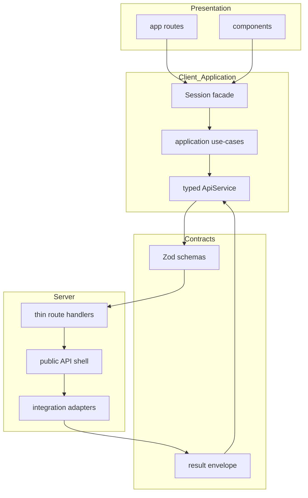

# Target architecture and migration rules

This document describes the **intended end state** and **rules for migrating** from the baseline in [`current.md`](./current.md). It implements the SOTA redesign roadmap (Phases 1–7). Directories listed below are **targets**; create them only when the corresponding phase starts to avoid empty layers.

## Principles

1. **Schema-first contracts** — Every public `app/api/*/route.ts` input and output is described with Zod (or equivalent) and shared types; the client (`ApiService`) consumes the same shapes.
2. **Thin route handlers** — Handlers validate, authorize (where applicable), rate-limit, delegate to services/adapters, and map errors to a stable envelope.
3. **Server-only integrations** — Gemini, OpenAI Realtime, Azure Speech, and Stripe logic live in server-side modules; secrets never leak into client bundles.
4. **Application use-cases** — Tutoring flows (send message, start exercise, retry) move into composable modules; `SessionProvider` remains the **stable façade** until a deliberate context split (see ADR-002).
5. **Eval-driven AI** — Tutor JSON normalization and safety behavior are covered by fixture-based tests (release gate).

## Target module map

Paths are relative to the app repo root (`Gemini-Clone/`).

### Contracts and API shell

| Path | Purpose |
|------|---------|
| `lib/contracts/conversation.ts` | Request/response schemas for tutor conversation APIs |
| `lib/contracts/realtime.ts` | OpenAI Realtime session minting |
| `lib/contracts/speech.ts` | Azure speech token responses |
| `lib/contracts/checkout.ts` | Stripe checkout session creation |
| `lib/api/result.ts` | Shared result envelope, e.g. `{ ok, data, error, meta }` |
| `lib/api/publicRoute.ts` | Shared public-route preflight: validation, rate limit, request id, error mapping |

### Server integration adapters

| Path | Purpose |
|------|---------|
| `lib/integrations/gemini/` | Model calls and streaming assembly for tutor |
| `lib/integrations/openaiRealtime/` | Realtime session creation |
| `lib/integrations/azureSpeech/` | Token minting |
| `lib/integrations/stripe/` | Checkout session creation |
| `lib/integrations/pronunciation/` | Pronunciation assessment proxy |

### Client session and application layer

| Path | Purpose |
|------|---------|
| `src/context/session/sessionReducer.ts` | Pure reducer + action types |
| `src/context/session/sessionActions.ts` | Action creators / helpers |
| `src/context/session/sessionSelectors.ts` | Derived state |
| `src/application/tutoring/sendTutorMessage.ts` | Send-message use-case |
| `src/application/tutoring/startExercise.ts` | Exercise start / opener use-case |
| `src/application/speaking/startRealtimeSession.ts` | Speaking session orchestration (as needed) |

### Quality

| Path | Purpose |
|------|---------|
| `tests/fixtures/tutor/` | Golden JSON and edge cases for tutor responses |
| `tests/evals/` | Regression/eval tests for normalization and safety |

Existing routes stay in place until migrated, for example:

- `app/api/conversation/route.ts`
- `app/api/conversation-stream/route.ts`

## Migration rules

- **Do not** introduce new empty top-level folders “for future use”; add a folder when the first file in that phase lands.
- **Preserve** `SessionProvider`’s public `SessionContextValue` during Phases 1–3 unless an ADR explicitly approves a breaking change.
- **Phase order:** contracts and boundary audit before large `SessionContext` extractions; unify AI normalization before changing external API shapes where possible.
- **Document** each significant boundary change with an ADR under [`docs/adr/`](../adr/).

## Mermaid: target layering

## Implementation status

- **Phase 1 (contracts):** `lib/contracts/*` defines Zod schemas for public API shapes; [`lib/api/result.ts`](../../lib/api/result.ts) defines the shared `ApiResult` envelope; [`lib/api/parseResponse.ts`](../../lib/api/parseResponse.ts) validates success JSON; [`src/services/apiService.ts`](../../src/services/apiService.ts) validates requests/responses against those schemas. Checkout uses [`lib/contracts/checkout.ts`](../../lib/contracts/checkout.ts) via the Phase 3 shell.
- **Phase 2 (boundary audit):** [`client-server-boundaries.md`](./client-server-boundaries.md) documents layout/providers, `useRealtimeTutor` / `usePronunciation`, and a `lib/` classification. Build-time guards: `import "server-only"` in [`lib/conversation-helpers.ts`](../../lib/conversation-helpers.ts), [`lib/tutor.ts`](../../lib/tutor.ts), and [`sentry.server.config.ts`](../../sentry.server.config.ts). [`lib/config.ts`](../../lib/config.ts) stays **shared** (Firebase client init). [`lib/rate-limiting.ts`](../../lib/rate-limiting.ts) remains unmarked until Jest mocks `server-only` or tests use a stub.
- **Phase 3 (Senior Architect plan) — session + application extraction:** [`src/context/session/`](../../src/context/session/) holds `sessionReducer`, `sessionActions`, and `sessionSelectors`; [`src/application/tutoring/`](../../src/application/tutoring/) holds `sendTutorMessage` and `startExercise` use-cases; [`SessionContext.tsx`](../../src/context/SessionContext.tsx) remains the stable façade (`SessionContextValue` unchanged for consumers).
- **Phase 4 (AI runtime + evals):** [`lib/tutor-runtime/normalizeAndSafety.ts`](../../lib/tutor-runtime/normalizeAndSafety.ts) is the single module for `normalizeAiToTutorResponse` and `applySafetyFilters` (used by [`app/api/conversation/route.ts`](../../app/api/conversation/route.ts) and re-exported from [`lib/conversation-helpers.ts`](../../lib/conversation-helpers.ts) for streaming). Golden payloads live under [`tests/fixtures/tutor/`](../../tests/fixtures/tutor/); regression tests under [`tests/evals/tutor-runtime.test.ts`](../../tests/evals/tutor-runtime.test.ts). [`lib/tutor-runtime/index.ts`](../../lib/tutor-runtime/index.ts) is `server-only`.
- **Public API shell (maps to plan Phase 5; labeled “Phase 3” here historically):** [`lib/api/publicRoute.ts`](../../lib/api/publicRoute.ts) centralizes rate-limit preflight, `x-request-id`, JSON parsing, Zod `parseBodyWithSchema`, and `handlePublicRouteError`. All `app/api/*/route.ts` handlers use the shell; conversation-stream uses `rateLimitFailOpen: true`.
- **Phase 6 (server-only integration adapters):** Provider-specific logic moved to [`lib/integrations/*/`](../../lib/integrations/) (Gemini, OpenAI Realtime, Azure Speech, Stripe, Pronunciation proxy). API routes now call adapters and keep transport/validation/error mapping thin.
- **Phase 7 (typed client façade + release gates):** [`src/services/apiService.ts`](../../src/services/apiService.ts) now generates `x-request-id` correlation headers and exposes typed client methods for OpenAI Realtime session minting and Azure Speech token minting; UI hooks (`useRealtimeTutor`, `usePronunciation`) call these methods instead of raw `/api/*` fetches. Release gate adds focused Jest coverage for schema contract smoke + critical route tests + AI evals (`npm run test:gate`).

## References

- ADRs: [`docs/adr/README.md`](../adr/README.md)
- Baseline: [`current.md`](./current.md)
- Project Cursor rules: [`.cursor/rules/norsk-tutor-architecture-boundaries.mdc`](../../.cursor/rules/norsk-tutor-architecture-boundaries.mdc)
