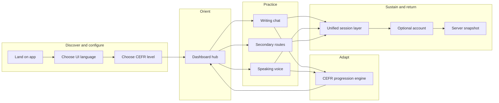
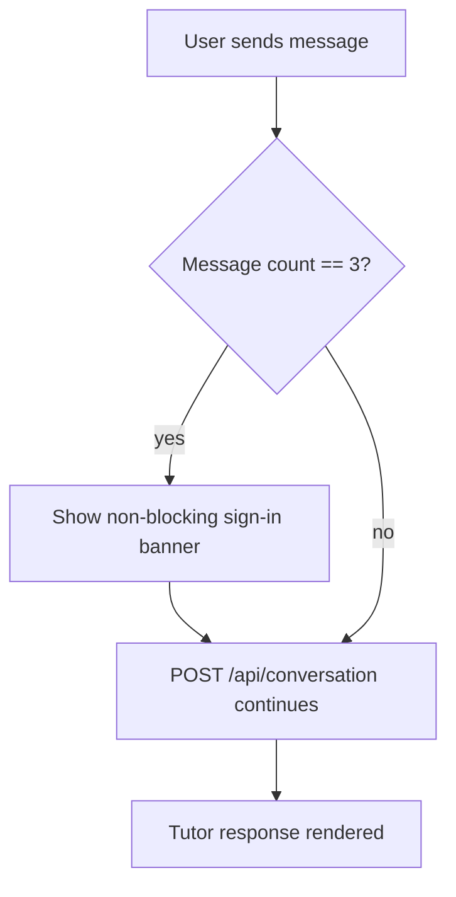
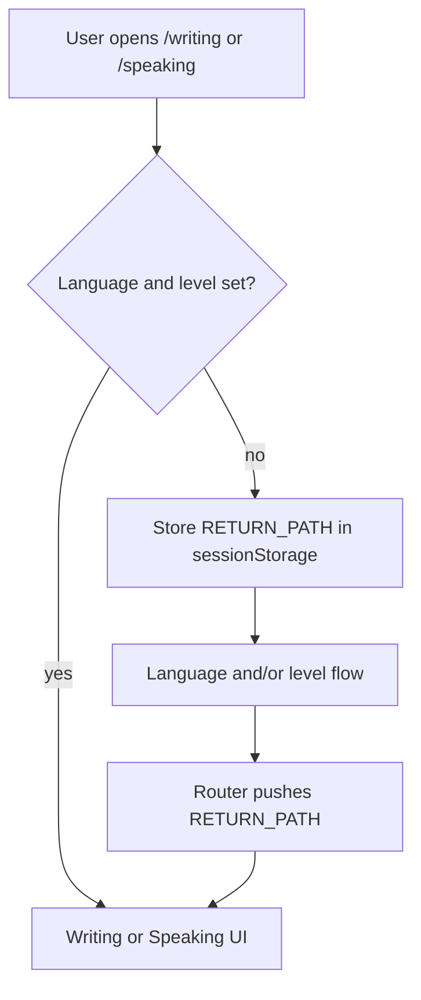

# User journey map — Norwegian Tutor (target / redesigned)

> **Status:** Target UX specification. For **as-built** journeys see [user-journey-map.md](user-journey-map.md).

This document describes **primary and secondary user journeys** through the redesigned product. Changes from the baseline are marked **[improved]** or **[new]**. For technical sequence diagrams see [Application flow (target)](application-flow-target.md).

---

## Persona (primary)

**Alex — adult Norwegian learner**

- Wants structured practice at a chosen CEFR level (A1–C2).
- Prefers UI in a familiar language (multi-language UI).
- May start anonymous; may sign in later for cross-device continuity.
- Switches between **text chat** (writing) and **voice** (speaking + pronunciation).
- Expects the app to notice when they're improving and respond accordingly.

---

## Journey overview

---

## Stage 1: First visit — configuration

**Goal:** Reach a usable practice state with UI language and CEFR level set.

| Element | Detail |
|--------|--------|
| **User actions** | Open app; pick UI language; pick CEFR level; confirm or return from level screen. |
| **Touchpoints** | `/language-selection` → `/level-selection` (skipped if already stored). |
| **System behaviour** | Saves `norsk_ui_language` and `norsk_cefr_level` in `localStorage`. Level screen stores `RETURN_PATH` so Writing/Speaking deep-links work after onboarding. |
| **Thoughts** | "Which language should I pick?" → "I'm not sure which level I am." |
| **Emotions** | Curious → mild friction if redirected more than once. |
| **Pain risks** | Changing UI language from level screen can wipe learning data (confirm dialog required — intentional reset). |
| **Opportunities** | [improved] Add explicit copy: "You can change your level at any time from the dashboard." |

---

## Stage 2: Dashboard — choose a path

**Goal:** Decide how to practice today; act on any level suggestion.

| Element | Detail |
|--------|--------|
| **User actions** | Scan cards; open Speaking, Writing, Tutors; use header for Settings or Change level. |
| **Touchpoints** | `/` — `useAppSetupGate("dashboard")` ensures language + level exist. |
| **System behaviour** | Reads `cefrLevel` from session context; localized strings via `LanguageContext`. **[new]** CEFR Progression Engine can show a non-blocking level suggestion banner. |
| **Thoughts** | "Do I want to type or speak today?" |
| **Emotions** | Oriented; motivated when a level-up suggestion appears. |

---

## Stage 3A: Writing (text tutoring) — improved

| Element | Detail |
|--------|--------|
| **System behaviour** | `onSent` → `sendTutorMessage` → `POST /api/conversation`. Session persisted via `SessionRepository`; snapshot sync when configured. |
| **Pain risks (resolved)** | **[improved]** Non-blocking sign-in nudge at message 3; hard gate at 50. |
| **Pain risks (resolved)** | **[improved]** Exercise uses `turnType: exercise_start` — no synthetic user line in history. |

### Writing auth flow (redesigned)

---

## Stage 3B: Speaking (voice + pronunciation) — improved

| Element | Detail |
|--------|--------|
| **System behaviour** | Realtime via `POST /api/openai-realtime`; pronunciation via Azure + `POST /api/pronunciation`. **[improved]** Fallback to `/writing` with toast. **[improved]** Turns persist into unified session layer. |

---

## Stage 3C: Secondary exploration

| Element | Detail |
|--------|--------|
| **Touchpoints** | `/settings`, `/review`, `/progress`, `/tutors`. |
| **System behaviour** | **[new]** `/progress` surfaces analytics-derived insights. |

---

## Stage 4: CEFR progression — new

`AnalyticsService` → `CEFRProgressionEngine` → dashboard banner → user confirms in `/level-selection` or equivalent.

---

## Stage 5: Persistence and return visits — improved

Bundle-level `updatedAt` for local vs server snapshot; deterministic merge; debounced sync.

---

## Stage 6: Authentication (parallel journey)

Firebase client auth; framing sign-in as "save across devices" via soft nudge.

---

## Shortcut: Deep link to Writing or Speaking without setup

---

## Summary of changes from baseline

| Area | Baseline | Redesigned |
|------|----------|------------|
| Auth gate | Hard block at N messages | Soft nudge at msg 3, hard block at msg 50 |
| Exercise mode | Synthetic `[EXERCISE_START]` | `turnType: exercise_start` in API |
| Speaking persistence | Limited | Unified with writing session |
| Speaking failure | Error only | Fallback to text mode |
| Session restore | Session max timestamps | Bundle `updatedAt` merge |
| Level progression | Manual | Engine suggests from analytics |
| Analytics | None | Per-turn `tutor_turn` events |

---

## Related docs

- [Application flow (target)](application-flow-target.md)
- [User journey map (baseline)](user-journey-map.md)
- [Application flow (baseline)](application-flow.md)
