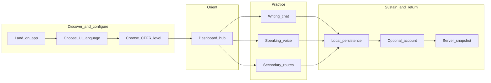
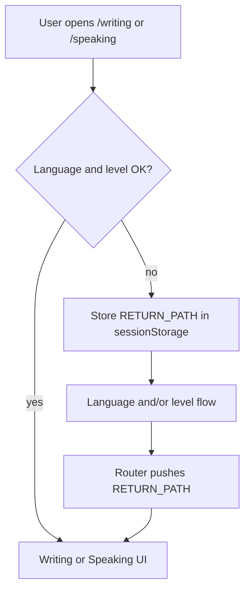

# User journey map — Norwegian Tutor

> **As-built:** This document reflects **current code**. For the **target / redesigned** journeys, see [User journey map (target)](user-journey-map-target.md).

This document describes **primary and secondary user journeys** through the product as implemented today: onboarding gates, practice modes, persistence, and optional sign-in. For technical sequence diagrams, see [Application flow](application-flow.md).

---

## Persona (primary)

**Alex — adult Norwegian learner**

- Wants structured practice at a chosen CEFR level (A1–C2).
- Prefers UI explanations in a familiar language (multi-language UI).
- May start anonymous; may sign in later for continuity across devices (when backend sync is configured).
- Switches between **text chat** (writing) and **voice** (speaking + pronunciation).

---

## Journey overview (stages)

---

## Stage 1: First visit — configuration

**Goal:** Get to a usable practice state with UI language + level set.

| Element | Detail |
|--------|--------|
| **User actions** | Open app; pick UI language; pick CEFR level; confirm or return from level screen. |
| **Touchpoints** | [`/language-selection`](../../app/language-selection/page.tsx) → [`/level-selection`](../../app/level-selection/page.tsx) (or skip language if already stored). |
| **System behavior** | Saves `norsk_ui_language` and `norsk_cefr_level` in `localStorage`; level selection sets `FROM_LEVEL_SELECTION` and routes to `RETURN_PATH` (if user came from writing/speaking) or `/`. |
| **Thoughts** | “Which language is the app in?” → “What’s my level?” |
| **Emotions** | Curious → mild friction if redirected multiple times. |
| **Pain risks** | Changing UI language from level screen can wipe learning data (confirm dialog + sync wipe) — intentional reset. |
| **Opportunities** | Clear copy that explains level can be changed later from dashboard/settings. |

---

## Stage 2: Dashboard — choose a path

**Goal:** Decide how to practice today.

| Element | Detail |
|--------|--------|
| **User actions** | Scan cards; open Speaking, Writing, Tutors, or use header for Settings / Change level. |
| **Touchpoints** | [`/`](../../app/page.tsx) (`useAppSetupGate("dashboard")` ensures language + level exist). |
| **System behavior** | Reads `cefrLevel` from session context; shows localized strings via `LanguageContext`. |
| **Thoughts** | “Do I want to type or speak?” |
| **Emotions** | Oriented, low cognitive load if setup is complete. |
| **Pain risks** | Missing setup → automatic redirect away from dashboard (can feel abrupt). |
| **Opportunities** | Banner (“new voice mode”) sets expectation for speaking features. |

---

## Stage 3A: Writing (text tutoring)

**Goal:** Have a conversation with the tutor; optionally run structured exercises.

| Element | Detail |
|--------|--------|
| **User actions** | Open sidebar sessions; type messages; start/change exercise mode; new chat. |
| **Touchpoints** | [`/writing`](../../app/writing/page.tsx) → [`Sidebar`](../../src/components/sidebar/Sidebar.tsx) + [`Main`](../../src/components/main/Main.tsx). |
| **System behavior** | `onSent` → `sendTutorMessage` → `POST /api/conversation`; messages persisted in `localStorage` via `SessionRepository`; debounced snapshot sync when configured. |
| **Thoughts** | “Is the answer helpful?” “Can I fix my Norwegian?” |
| **Emotions** | Engaged; possible frustration on API errors or slow responses. |
| **Pain risks** | Product can enforce sign-in after N messages (`AUTH_REQUIRED_MESSAGE_COUNT` in [`lib/constants.ts`](../../lib/constants.ts)) — currently set very high, so gate is effectively off unless changed. |
| **Opportunities** | Visible sync status (when logged in) builds trust for cross-device use. |

---

## Stage 3B: Speaking (voice + pronunciation)

**Goal:** Practice listening/speaking; optional drill against a reference sentence.

| Element | Detail |
|--------|--------|
| **User actions** | Choose conversation vs drill; set reference text for drill; start/stop session; adjust volume/mute. |
| **Touchpoints** | [`/speaking`](../../app/speaking/page.tsx) → [`useSpeakingSessionController`](../../src/components/speaking/useSpeakingSessionController.ts). |
| **System behavior** | Realtime session via `POST /api/openai-realtime`; pronunciation via Azure token + `POST /api/pronunciation` when used. |
| **Thoughts** | “Can it hear me?” “How accurate was my pronunciation?” |
| **Emotions** | Excitement or anxiety (mic permissions, latency). |
| **Pain risks** | Env keys / network issues surface as connection errors. |
| **Opportunities** | Clear status states (idle / connecting / listening) reduce uncertainty. |

---

## Stage 3C: Secondary exploration

**Goal:** Settings, vocabulary review, progress, or browsing tutors.

| Element | Detail |
|--------|--------|
| **Touchpoints** | [`/settings`](../../app/settings/page.tsx), [`/review`](../../app/review/page.tsx), [`/progress`](../../app/progress/page.tsx), [`/tutors`](../../app/tutors/page.tsx). |
| **System behavior** | Same global providers; data mostly client-side + optional APIs per feature. |
| **Thoughts** | “Tune my experience” / “See what I learned.” |

---

## Stage 4: Persistence and return visits

**Goal:** Resume without re-entering everything; optionally sync across devices.

| Element | Detail |
|--------|--------|
| **User actions** | Close tab; reopen later; maybe sign in on second device. |
| **Touchpoints** | Transparent — [`SessionContext`](../../src/context/SessionContext.tsx), [`ApiService`](../../src/services/apiService.ts). |
| **System behavior** | Local sessions in `localStorage`; on load, `GET /api/sessions/restore` may replace local if server snapshot is newer; changes debounced to `POST /api/sessions/sync` with `x-device-id` and optional Firebase `Bearer` token. |
| **Thoughts** | “Did it remember my chat?” |
| **Emotions** | Relief when restore works; confusion if two tabs diverge (multi-tab sync events mitigate). |
| **Pain risks** | No Redis/backend → sync no-ops gracefully but no cross-device restore. |
| **Opportunities** | Surface “last saved” or sync errors non-intrusively in UI. |

---

## Stage 5: Authentication (parallel journey)

**Goal:** Create identity for persistence, billing, or future features.

| Element | Detail |
|--------|--------|
| **User actions** | Email/password or Google sign-in; sign out from settings flows as applicable. |
| **Touchpoints** | [`/auth`](../../app/auth/page.tsx); [`AuthContext`](../../src/context/AuthContext.tsx). |
| **System behavior** | Firebase client auth; `norsk_user` in `localStorage`; on login, associate anonymous `norsk_sessions` with `uid`. Server routes verify ID token for user-scoped snapshot writes. |
| **Thoughts** | “Do I need an account yet?” |
| **Emotions** | Trust hinge — clear why sign-in helps (sync, limits). |

---

## Shortcut: Deep link to Writing or Speaking without level

If the user opens `/writing` or `/speaking` first:

1. `useAppSetupGate` may send them to `/language-selection` or `/level-selection`.
2. `RETURN_PATH` preserves intent so after level pick they land back on `/writing` or `/speaking`.

---

## Related docs

- [User journey map (target)](user-journey-map-target.md) — redesigned journeys (roadmap).
- [Application flow](application-flow.md) — technical flows, APIs, and Mermaid diagrams.
- [Application flow (target)](application-flow-target.md) — redesigned technical flows.
- [Current architecture (baseline)](current.md) — providers and session layer.
